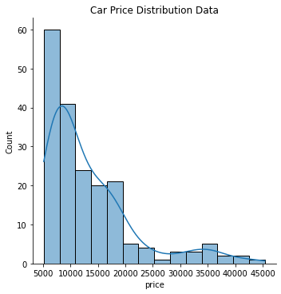
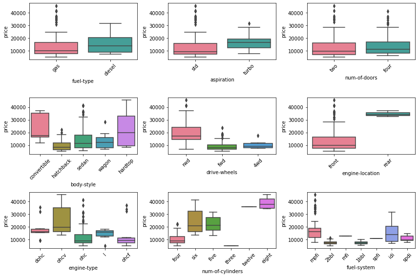
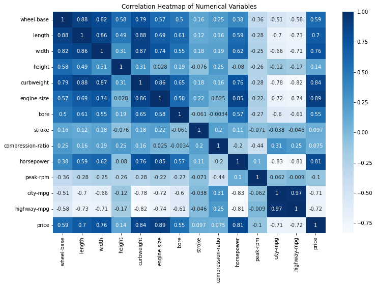
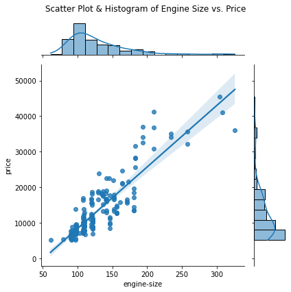
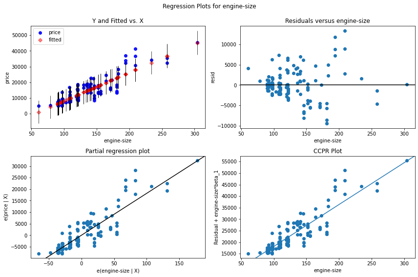
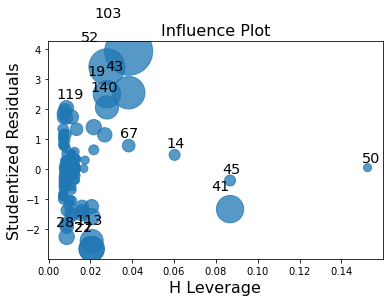
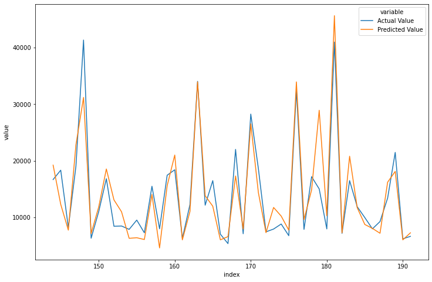

The objective of this project is to perform linear regression analysis (ordinary least square technique) using Python Statsmodels to predict the car price, based on the automobile dataset from [UCI Machine Learning repository](https://archive.ics.uci.edu/ml/datasets/automobile), which is a common dataset for regression analysis. The automobile dataset is from the year 1985 which is quite old, but it's suitable for the learning purposes of this project.
<br/>
You can find the project's jupyter notebook and the dataset (if you want to skip extracting step) on my [GitHub repository](https://github.com/mohammad-agus/linear_regression_ordinary_least_square).

### Import Library


```python
import numpy as np
import pandas as pd

import scipy.stats as stats
import statsmodels.api as sm

import seaborn as sns
import matplotlib.pyplot as plt

from urllib import request # download dataset description from the source

import warnings
warnings.filterwarnings('ignore')
```

# Data Preprocessing & Exploration

### Extract the Dataset

* Download and read the dataset description


```python
data_desc_url = "https://archive.ics.uci.edu/ml/machine-learning-databases/autos/imports-85.names"
response = request.urlretrieve(data_desc_url, "dataset/data_desc.names")

with open("dataset/data_desc.names") as data_desc:
    print(data_desc.read())
```

    1. Title: 1985 Auto Imports Database
    
    2. Source Information:
       -- Creator/Donor: Jeffrey C. Schlimmer (Jeffrey.Schlimmer@a.gp.cs.cmu.edu)
       -- Date: 19 May 1987
       -- Sources:
         1) 1985 Model Import Car and Truck Specifications, 1985 Ward's
            Automotive Yearbook.
         2) Personal Auto Manuals, Insurance Services Office, 160 Water
            Street, New York, NY 10038 
         3) Insurance Collision Report, Insurance Institute for Highway
            Safety, Watergate 600, Washington, DC 20037
    
    3. Past Usage:
       -- Kibler,~D., Aha,~D.~W., \& Albert,~M. (1989).  Instance-based prediction
          of real-valued attributes.  {\it Computational Intelligence}, {\it 5},
          51--57.
    	 -- Predicted price of car using all numeric and Boolean attributes
    	 -- Method: an instance-based learning (IBL) algorithm derived from a
    	    localized k-nearest neighbor algorithm.  Compared with a
    	    linear regression prediction...so all instances
    	    with missing attribute values were discarded.  This resulted with
    	    a training set of 159 instances, which was also used as a test
    	    set (minus the actual instance during testing).
    	 -- Results: Percent Average Deviation Error of Prediction from Actual
    	    -- 11.84% for the IBL algorithm
    	    -- 14.12% for the resulting linear regression equation
    
    4. Relevant Information:
       -- Description
          This data set consists of three types of entities: (a) the
          specification of an auto in terms of various characteristics, (b)
          its assigned insurance risk rating, (c) its normalized losses in use
          as compared to other cars.  The second rating corresponds to the
          degree to which the auto is more risky than its price indicates.
          Cars are initially assigned a risk factor symbol associated with its
          price.   Then, if it is more risky (or less), this symbol is
          adjusted by moving it up (or down) the scale.  Actuarians call this
          process "symboling".  A value of +3 indicates that the auto is
          risky, -3 that it is probably pretty safe.
    
          The third factor is the relative average loss payment per insured
          vehicle year.  This value is normalized for all autos within a
          particular size classification (two-door small, station wagons,
          sports/speciality, etc...), and represents the average loss per car
          per year.
    
       -- Note: Several of the attributes in the database could be used as a
                "class" attribute.
    
    5. Number of Instances: 205
    
    6. Number of Attributes: 26 total
       -- 15 continuous
       -- 1 integer
       -- 10 nominal
    
    7. Attribute Information:     
         Attribute:                Attribute Range:
         ------------------        -----------------------------------------------
      1. symboling:                -3, -2, -1, 0, 1, 2, 3.
      2. normalized-losses:        continuous from 65 to 256.
      3. make:                     alfa-romero, audi, bmw, chevrolet, dodge, honda,
                                   isuzu, jaguar, mazda, mercedes-benz, mercury,
                                   mitsubishi, nissan, peugot, plymouth, porsche,
                                   renault, saab, subaru, toyota, volkswagen, volvo
      4. fuel-type:                diesel, gas.
      5. aspiration:               std, turbo.
      6. num-of-doors:             four, two.
      7. body-style:               hardtop, wagon, sedan, hatchback, convertible.
      8. drive-wheels:             4wd, fwd, rwd.
      9. engine-location:          front, rear.
     10. wheel-base:               continuous from 86.6 120.9.
     11. length:                   continuous from 141.1 to 208.1.
     12. width:                    continuous from 60.3 to 72.3.
     13. height:                   continuous from 47.8 to 59.8.
     14. curb-weight:              continuous from 1488 to 4066.
     15. engine-type:              dohc, dohcv, l, ohc, ohcf, ohcv, rotor.
     16. num-of-cylinders:         eight, five, four, six, three, twelve, two.
     17. engine-size:              continuous from 61 to 326.
     18. fuel-system:              1bbl, 2bbl, 4bbl, idi, mfi, mpfi, spdi, spfi.
     19. bore:                     continuous from 2.54 to 3.94.
     20. stroke:                   continuous from 2.07 to 4.17.
     21. compression-ratio:        continuous from 7 to 23.
     22. horsepower:               continuous from 48 to 288.
     23. peak-rpm:                 continuous from 4150 to 6600.
     24. city-mpg:                 continuous from 13 to 49.
     25. highway-mpg:              continuous from 16 to 54.
     26. price:                    continuous from 5118 to 45400.
    
    8. Missing Attribute Values: (denoted by "?")
       Attribute #:   Number of instances missing a value:
       2.             41
       6.             2
       19.            4
       20.            4
       22.            2
       23.            2
       26.            4
    
    
    
    
    


* Read the dataset and assign the column header


```python
data_url = "https://archive.ics.uci.edu/ml/machine-learning-databases/autos/imports-85.data" # url source dataset
df = pd.read_csv(data_url)
df.head()
```


<div>
<style scoped>
    .dataframe tbody tr th:only-of-type {
        vertical-align: middle;
    }

    .dataframe tbody tr th {
        vertical-align: top;
    }

    .dataframe thead th {
        text-align: right;
    }
</style>
<table border="1" class="dataframe">
  <thead>
    <tr style="text-align: right;">
      <th></th>
      <th>3</th>
      <th>?</th>
      <th>alfa-romero</th>
      <th>gas</th>
      <th>std</th>
      <th>two</th>
      <th>convertible</th>
      <th>rwd</th>
      <th>front</th>
      <th>88.60</th>
      <th>...</th>
      <th>130</th>
      <th>mpfi</th>
      <th>3.47</th>
      <th>2.68</th>
      <th>9.00</th>
      <th>111</th>
      <th>5000</th>
      <th>21</th>
      <th>27</th>
      <th>13495</th>
    </tr>
  </thead>
  <tbody>
    <tr>
      <th>0</th>
      <td>3</td>
      <td>?</td>
      <td>alfa-romero</td>
      <td>gas</td>
      <td>std</td>
      <td>two</td>
      <td>convertible</td>
      <td>rwd</td>
      <td>front</td>
      <td>88.6</td>
      <td>...</td>
      <td>130</td>
      <td>mpfi</td>
      <td>3.47</td>
      <td>2.68</td>
      <td>9.0</td>
      <td>111</td>
      <td>5000</td>
      <td>21</td>
      <td>27</td>
      <td>16500</td>
    </tr>
    <tr>
      <th>1</th>
      <td>1</td>
      <td>?</td>
      <td>alfa-romero</td>
      <td>gas</td>
      <td>std</td>
      <td>two</td>
      <td>hatchback</td>
      <td>rwd</td>
      <td>front</td>
      <td>94.5</td>
      <td>...</td>
      <td>152</td>
      <td>mpfi</td>
      <td>2.68</td>
      <td>3.47</td>
      <td>9.0</td>
      <td>154</td>
      <td>5000</td>
      <td>19</td>
      <td>26</td>
      <td>16500</td>
    </tr>
    <tr>
      <th>2</th>
      <td>2</td>
      <td>164</td>
      <td>audi</td>
      <td>gas</td>
      <td>std</td>
      <td>four</td>
      <td>sedan</td>
      <td>fwd</td>
      <td>front</td>
      <td>99.8</td>
      <td>...</td>
      <td>109</td>
      <td>mpfi</td>
      <td>3.19</td>
      <td>3.40</td>
      <td>10.0</td>
      <td>102</td>
      <td>5500</td>
      <td>24</td>
      <td>30</td>
      <td>13950</td>
    </tr>
    <tr>
      <th>3</th>
      <td>2</td>
      <td>164</td>
      <td>audi</td>
      <td>gas</td>
      <td>std</td>
      <td>four</td>
      <td>sedan</td>
      <td>4wd</td>
      <td>front</td>
      <td>99.4</td>
      <td>...</td>
      <td>136</td>
      <td>mpfi</td>
      <td>3.19</td>
      <td>3.40</td>
      <td>8.0</td>
      <td>115</td>
      <td>5500</td>
      <td>18</td>
      <td>22</td>
      <td>17450</td>
    </tr>
    <tr>
      <th>4</th>
      <td>2</td>
      <td>?</td>
      <td>audi</td>
      <td>gas</td>
      <td>std</td>
      <td>two</td>
      <td>sedan</td>
      <td>fwd</td>
      <td>front</td>
      <td>99.8</td>
      <td>...</td>
      <td>136</td>
      <td>mpfi</td>
      <td>3.19</td>
      <td>3.40</td>
      <td>8.5</td>
      <td>110</td>
      <td>5500</td>
      <td>19</td>
      <td>25</td>
      <td>15250</td>
    </tr>
  </tbody>
</table>
<p>5 rows × 26 columns</p>
</div>


As shown above, the dataset doesn't contain the column header. Here is the column list that has been created manually based on the dataset descriptions.


```python
column = [  'symboling', 'normalized-losses', 'make', 'fuel-type', 'aspiration',
            'num-of-doors', 'body-style', 'drive-wheels', 'engine-location', 'wheel-base',
            'length', 'width', 'height', 'curbweight', 'engine-type', 'num-of-cylinders',
            'engine-size', 'fuel-system', 'bore', 'stroke', 'compression-ratio', 'horsepower', 
            'peak-rpm', 'city-mpg', 'highway-mpg', 'price' ]

data_url = "https://archive.ics.uci.edu/ml/machine-learning-databases/autos/imports-85.data"
df.columns = column
df.head()
```


<div>
<style scoped>
    .dataframe tbody tr th:only-of-type {
        vertical-align: middle;
    }

    .dataframe tbody tr th {
        vertical-align: top;
    }

    .dataframe thead th {
        text-align: right;
    }
</style>
<table border="1" class="dataframe">
  <thead>
    <tr style="text-align: right;">
      <th></th>
      <th>symboling</th>
      <th>normalized-losses</th>
      <th>make</th>
      <th>fuel-type</th>
      <th>aspiration</th>
      <th>num-of-doors</th>
      <th>body-style</th>
      <th>drive-wheels</th>
      <th>engine-location</th>
      <th>wheel-base</th>
      <th>...</th>
      <th>engine-size</th>
      <th>fuel-system</th>
      <th>bore</th>
      <th>stroke</th>
      <th>compression-ratio</th>
      <th>horsepower</th>
      <th>peak-rpm</th>
      <th>city-mpg</th>
      <th>highway-mpg</th>
      <th>price</th>
    </tr>
  </thead>
  <tbody>
    <tr>
      <th>0</th>
      <td>3</td>
      <td>?</td>
      <td>alfa-romero</td>
      <td>gas</td>
      <td>std</td>
      <td>two</td>
      <td>convertible</td>
      <td>rwd</td>
      <td>front</td>
      <td>88.6</td>
      <td>...</td>
      <td>130</td>
      <td>mpfi</td>
      <td>3.47</td>
      <td>2.68</td>
      <td>9.0</td>
      <td>111</td>
      <td>5000</td>
      <td>21</td>
      <td>27</td>
      <td>16500</td>
    </tr>
    <tr>
      <th>1</th>
      <td>1</td>
      <td>?</td>
      <td>alfa-romero</td>
      <td>gas</td>
      <td>std</td>
      <td>two</td>
      <td>hatchback</td>
      <td>rwd</td>
      <td>front</td>
      <td>94.5</td>
      <td>...</td>
      <td>152</td>
      <td>mpfi</td>
      <td>2.68</td>
      <td>3.47</td>
      <td>9.0</td>
      <td>154</td>
      <td>5000</td>
      <td>19</td>
      <td>26</td>
      <td>16500</td>
    </tr>
    <tr>
      <th>2</th>
      <td>2</td>
      <td>164</td>
      <td>audi</td>
      <td>gas</td>
      <td>std</td>
      <td>four</td>
      <td>sedan</td>
      <td>fwd</td>
      <td>front</td>
      <td>99.8</td>
      <td>...</td>
      <td>109</td>
      <td>mpfi</td>
      <td>3.19</td>
      <td>3.40</td>
      <td>10.0</td>
      <td>102</td>
      <td>5500</td>
      <td>24</td>
      <td>30</td>
      <td>13950</td>
    </tr>
    <tr>
      <th>3</th>
      <td>2</td>
      <td>164</td>
      <td>audi</td>
      <td>gas</td>
      <td>std</td>
      <td>four</td>
      <td>sedan</td>
      <td>4wd</td>
      <td>front</td>
      <td>99.4</td>
      <td>...</td>
      <td>136</td>
      <td>mpfi</td>
      <td>3.19</td>
      <td>3.40</td>
      <td>8.0</td>
      <td>115</td>
      <td>5500</td>
      <td>18</td>
      <td>22</td>
      <td>17450</td>
    </tr>
    <tr>
      <th>4</th>
      <td>2</td>
      <td>?</td>
      <td>audi</td>
      <td>gas</td>
      <td>std</td>
      <td>two</td>
      <td>sedan</td>
      <td>fwd</td>
      <td>front</td>
      <td>99.8</td>
      <td>...</td>
      <td>136</td>
      <td>mpfi</td>
      <td>3.19</td>
      <td>3.40</td>
      <td>8.5</td>
      <td>110</td>
      <td>5500</td>
      <td>19</td>
      <td>25</td>
      <td>15250</td>
    </tr>
  </tbody>
</table>
<p>5 rows × 26 columns</p>
</div>


### Data Cleaning

* Check the null value
<br/>
The null values denoted by '?' sign


```python
print(df.shape)
print(df.isin(['?']).sum())
```

    (204, 26)
    symboling             0
    normalized-losses    40
    make                  0
    fuel-type             0
    aspiration            0
    num-of-doors          2
    body-style            0
    drive-wheels          0
    engine-location       0
    wheel-base            0
    length                0
    width                 0
    height                0
    curbweight            0
    engine-type           0
    num-of-cylinders      0
    engine-size           0
    fuel-system           0
    bore                  4
    stroke                4
    compression-ratio     0
    horsepower            2
    peak-rpm              2
    city-mpg              0
    highway-mpg           0
    price                 4
    dtype: int64


* Handle the missing values
<br/> All the null values will be removed, starting with normalized-losses column (otherwise all 40 rows will be removed) along with the symboling column because there is no enough information about this feature. For the rest of the missing values, replace '?' sign with a null value (numpy.nan) then perform dropna().


```python
df.drop(['normalized-losses','symboling'], axis=1, inplace=True)
df.replace('?', np.nan, inplace=True)
df.dropna(inplace=True)
df.head()
```


<div>
<style scoped>
    .dataframe tbody tr th:only-of-type {
        vertical-align: middle;
    }

    .dataframe tbody tr th {
        vertical-align: top;
    }

    .dataframe thead th {
        text-align: right;
    }
</style>
<table border="1" class="dataframe">
  <thead>
    <tr style="text-align: right;">
      <th></th>
      <th>make</th>
      <th>fuel-type</th>
      <th>aspiration</th>
      <th>num-of-doors</th>
      <th>body-style</th>
      <th>drive-wheels</th>
      <th>engine-location</th>
      <th>wheel-base</th>
      <th>length</th>
      <th>width</th>
      <th>...</th>
      <th>engine-size</th>
      <th>fuel-system</th>
      <th>bore</th>
      <th>stroke</th>
      <th>compression-ratio</th>
      <th>horsepower</th>
      <th>peak-rpm</th>
      <th>city-mpg</th>
      <th>highway-mpg</th>
      <th>price</th>
    </tr>
  </thead>
  <tbody>
    <tr>
      <th>0</th>
      <td>alfa-romero</td>
      <td>gas</td>
      <td>std</td>
      <td>two</td>
      <td>convertible</td>
      <td>rwd</td>
      <td>front</td>
      <td>88.6</td>
      <td>168.8</td>
      <td>64.1</td>
      <td>...</td>
      <td>130</td>
      <td>mpfi</td>
      <td>3.47</td>
      <td>2.68</td>
      <td>9.0</td>
      <td>111</td>
      <td>5000</td>
      <td>21</td>
      <td>27</td>
      <td>16500</td>
    </tr>
    <tr>
      <th>1</th>
      <td>alfa-romero</td>
      <td>gas</td>
      <td>std</td>
      <td>two</td>
      <td>hatchback</td>
      <td>rwd</td>
      <td>front</td>
      <td>94.5</td>
      <td>171.2</td>
      <td>65.5</td>
      <td>...</td>
      <td>152</td>
      <td>mpfi</td>
      <td>2.68</td>
      <td>3.47</td>
      <td>9.0</td>
      <td>154</td>
      <td>5000</td>
      <td>19</td>
      <td>26</td>
      <td>16500</td>
    </tr>
    <tr>
      <th>2</th>
      <td>audi</td>
      <td>gas</td>
      <td>std</td>
      <td>four</td>
      <td>sedan</td>
      <td>fwd</td>
      <td>front</td>
      <td>99.8</td>
      <td>176.6</td>
      <td>66.2</td>
      <td>...</td>
      <td>109</td>
      <td>mpfi</td>
      <td>3.19</td>
      <td>3.40</td>
      <td>10.0</td>
      <td>102</td>
      <td>5500</td>
      <td>24</td>
      <td>30</td>
      <td>13950</td>
    </tr>
    <tr>
      <th>3</th>
      <td>audi</td>
      <td>gas</td>
      <td>std</td>
      <td>four</td>
      <td>sedan</td>
      <td>4wd</td>
      <td>front</td>
      <td>99.4</td>
      <td>176.6</td>
      <td>66.4</td>
      <td>...</td>
      <td>136</td>
      <td>mpfi</td>
      <td>3.19</td>
      <td>3.40</td>
      <td>8.0</td>
      <td>115</td>
      <td>5500</td>
      <td>18</td>
      <td>22</td>
      <td>17450</td>
    </tr>
    <tr>
      <th>4</th>
      <td>audi</td>
      <td>gas</td>
      <td>std</td>
      <td>two</td>
      <td>sedan</td>
      <td>fwd</td>
      <td>front</td>
      <td>99.8</td>
      <td>177.3</td>
      <td>66.3</td>
      <td>...</td>
      <td>136</td>
      <td>mpfi</td>
      <td>3.19</td>
      <td>3.40</td>
      <td>8.5</td>
      <td>110</td>
      <td>5500</td>
      <td>19</td>
      <td>25</td>
      <td>15250</td>
    </tr>
  </tbody>
</table>
<p>5 rows × 24 columns</p>
</div>


```python
df.shape
```


    (192, 24)


After the null values were removed, now the dataset consist of 192 rows and 24 features (columns).

* Check the data type of df dataset columns


```python
df.info()
```

    <class 'pandas.core.frame.DataFrame'>
    Int64Index: 192 entries, 0 to 203
    Data columns (total 24 columns):
     #   Column             Non-Null Count  Dtype  
    ---  ------             --------------  -----  
     0   make               192 non-null    object 
     1   fuel-type          192 non-null    object 
     2   aspiration         192 non-null    object 
     3   num-of-doors       192 non-null    object 
     4   body-style         192 non-null    object 
     5   drive-wheels       192 non-null    object 
     6   engine-location    192 non-null    object 
     7   wheel-base         192 non-null    float64
     8   length             192 non-null    float64
     9   width              192 non-null    float64
     10  height             192 non-null    float64
     11  curbweight         192 non-null    int64  
     12  engine-type        192 non-null    object 
     13  num-of-cylinders   192 non-null    object 
     14  engine-size        192 non-null    int64  
     15  fuel-system        192 non-null    object 
     16  bore               192 non-null    object 
     17  stroke             192 non-null    object 
     18  compression-ratio  192 non-null    float64
     19  horsepower         192 non-null    object 
     20  peak-rpm           192 non-null    object 
     21  city-mpg           192 non-null    int64  
     22  highway-mpg        192 non-null    int64  
     23  price              192 non-null    object 
    dtypes: float64(5), int64(4), object(15)
    memory usage: 37.5+ KB


The df.info() shows that there are some columns hasn't have the correct data type

* Convert the columns datatype


```python
# to float
to_float = ['bore', 'stroke', 'horsepower', 'peak-rpm', 'price']

for i in to_float:
    df[i] = df[i].astype(float)
    
df.info()
```

    <class 'pandas.core.frame.DataFrame'>
    Int64Index: 192 entries, 0 to 203
    Data columns (total 24 columns):
     #   Column             Non-Null Count  Dtype  
    ---  ------             --------------  -----  
     0   make               192 non-null    object 
     1   fuel-type          192 non-null    object 
     2   aspiration         192 non-null    object 
     3   num-of-doors       192 non-null    object 
     4   body-style         192 non-null    object 
     5   drive-wheels       192 non-null    object 
     6   engine-location    192 non-null    object 
     7   wheel-base         192 non-null    float64
     8   length             192 non-null    float64
     9   width              192 non-null    float64
     10  height             192 non-null    float64
     11  curbweight         192 non-null    int64  
     12  engine-type        192 non-null    object 
     13  num-of-cylinders   192 non-null    object 
     14  engine-size        192 non-null    int64  
     15  fuel-system        192 non-null    object 
     16  bore               192 non-null    float64
     17  stroke             192 non-null    float64
     18  compression-ratio  192 non-null    float64
     19  horsepower         192 non-null    float64
     20  peak-rpm           192 non-null    float64
     21  city-mpg           192 non-null    int64  
     22  highway-mpg        192 non-null    int64  
     23  price              192 non-null    float64
    dtypes: float64(10), int64(4), object(10)
    memory usage: 37.5+ KB


Now, the columns have the correct data type and it's ready for some calculations

* Histogram of the Car Price
<br/>
The value that will be predicted (Price) is called the Target or Dependent Variable and the predictor is called the Features or Independent Variables.


```python
plt.figure(figsize=(12,8))
sns.displot(df['price'], kde=True)
plt.title('Car Price Distribution Data')
plt.show()
```


    <Figure size 864x576 with 0 Axes>


    

    


As shown in the plot above, most of the car prices are concentrated between the range 5000 to 20000 and the data has right-skewed distribution.

* Price range based on categorical variables


```python
cat_var = df.loc[: , df.columns!='make'].select_dtypes(include=['object'])

plt.figure(figsize=(12,8))
for i in enumerate(cat_var.columns): # enumerate(df.columns): return list of tuple(index column, name of column)
    plt.subplot(3,3, i[0]+1) # 3 rows, 3 columns, index enumerate() + 1
    sns.boxplot(data=df,  x=i[1], y='price', palette="husl") # x: name of the column
    plt.xticks(rotation = 45)
    plt.tight_layout()
```


    

    


There are some outliers data based on the plots, but it's permissible for several reasons. Their occurrence is natural and the error can't be identified or corrected. So in this step, the outliers won't be removed.

* Summary of the numerical value


```python
num_var = df.loc[: , df.columns!='make'].select_dtypes(include=['float','int64'])
num_var.describe() # or df.describe
```


<div>
<style scoped>
    .dataframe tbody tr th:only-of-type {
        vertical-align: middle;
    }

    .dataframe tbody tr th {
        vertical-align: top;
    }

    .dataframe thead th {
        text-align: right;
    }
</style>
<table border="1" class="dataframe">
  <thead>
    <tr style="text-align: right;">
      <th></th>
      <th>wheel-base</th>
      <th>length</th>
      <th>width</th>
      <th>height</th>
      <th>curbweight</th>
      <th>engine-size</th>
      <th>bore</th>
      <th>stroke</th>
      <th>compression-ratio</th>
      <th>horsepower</th>
      <th>peak-rpm</th>
      <th>city-mpg</th>
      <th>highway-mpg</th>
      <th>price</th>
    </tr>
  </thead>
  <tbody>
    <tr>
      <th>count</th>
      <td>192.000000</td>
      <td>192.000000</td>
      <td>192.000000</td>
      <td>192.000000</td>
      <td>192.000000</td>
      <td>192.000000</td>
      <td>192.000000</td>
      <td>192.000000</td>
      <td>192.000000</td>
      <td>192.000000</td>
      <td>192.000000</td>
      <td>192.000000</td>
      <td>192.000000</td>
      <td>192.000000</td>
    </tr>
    <tr>
      <th>mean</th>
      <td>98.977604</td>
      <td>174.355208</td>
      <td>65.903125</td>
      <td>53.896354</td>
      <td>2561.578125</td>
      <td>128.114583</td>
      <td>3.329896</td>
      <td>3.251823</td>
      <td>10.149583</td>
      <td>103.442708</td>
      <td>5100.260417</td>
      <td>25.348958</td>
      <td>30.807292</td>
      <td>13283.932292</td>
    </tr>
    <tr>
      <th>std</th>
      <td>6.122858</td>
      <td>12.504792</td>
      <td>2.139431</td>
      <td>2.372693</td>
      <td>528.076113</td>
      <td>41.698963</td>
      <td>0.272909</td>
      <td>0.313541</td>
      <td>3.987026</td>
      <td>38.055441</td>
      <td>469.864005</td>
      <td>6.396833</td>
      <td>6.829207</td>
      <td>8110.216546</td>
    </tr>
    <tr>
      <th>min</th>
      <td>86.600000</td>
      <td>141.100000</td>
      <td>60.300000</td>
      <td>47.800000</td>
      <td>1488.000000</td>
      <td>61.000000</td>
      <td>2.540000</td>
      <td>2.070000</td>
      <td>7.000000</td>
      <td>48.000000</td>
      <td>4150.000000</td>
      <td>13.000000</td>
      <td>16.000000</td>
      <td>5118.000000</td>
    </tr>
    <tr>
      <th>25%</th>
      <td>94.500000</td>
      <td>166.300000</td>
      <td>64.075000</td>
      <td>52.000000</td>
      <td>2143.750000</td>
      <td>98.000000</td>
      <td>3.150000</td>
      <td>3.110000</td>
      <td>8.500000</td>
      <td>70.000000</td>
      <td>4800.000000</td>
      <td>19.000000</td>
      <td>25.000000</td>
      <td>7725.750000</td>
    </tr>
    <tr>
      <th>50%</th>
      <td>97.100000</td>
      <td>173.200000</td>
      <td>65.450000</td>
      <td>54.100000</td>
      <td>2414.000000</td>
      <td>120.000000</td>
      <td>3.310000</td>
      <td>3.290000</td>
      <td>9.000000</td>
      <td>95.000000</td>
      <td>5100.000000</td>
      <td>25.000000</td>
      <td>30.000000</td>
      <td>10221.500000</td>
    </tr>
    <tr>
      <th>75%</th>
      <td>102.400000</td>
      <td>184.600000</td>
      <td>66.900000</td>
      <td>55.700000</td>
      <td>2952.500000</td>
      <td>146.000000</td>
      <td>3.590000</td>
      <td>3.410000</td>
      <td>9.400000</td>
      <td>116.000000</td>
      <td>5500.000000</td>
      <td>30.000000</td>
      <td>34.500000</td>
      <td>16525.750000</td>
    </tr>
    <tr>
      <th>max</th>
      <td>120.900000</td>
      <td>208.100000</td>
      <td>72.000000</td>
      <td>59.800000</td>
      <td>4066.000000</td>
      <td>326.000000</td>
      <td>3.940000</td>
      <td>4.170000</td>
      <td>23.000000</td>
      <td>262.000000</td>
      <td>6600.000000</td>
      <td>49.000000</td>
      <td>54.000000</td>
      <td>45400.000000</td>
    </tr>
  </tbody>
</table>
</div>


* Plot a heatmap based on the correlation value of each numerical variables


```python
plt.figure(figsize=(12,8))
sns.heatmap(num_var.corr(), annot=True, cmap='Blues')
plt.title('Correlation Heatmap of Numerical Variables')
plt.show()
```


    

    


Based on the heatmap, several variables have strong positive or negative correlations. In the simple linear regression analysis, engine-size will be used as the predictor. Then, all the categorical and numerical variables that have been explored before, will be used in the multiple linear regression analysis as well.

# Simple Linear Regression

* Scatter plot and histogram (joint plot) of engine-size vs price


```python
plt.figure(figsize=(12,8))
sns.jointplot(data=df, x='engine-size', y='price', kind='reg').fig.suptitle("Scatter Plot & Histogram of Engine Size vs. Price")
plt.tight_layout()
plt.show()
```


    <Figure size 864x576 with 0 Axes>


    

    


* Duplicate df dataframe and randomly return the sample of the dataframe
<br/>
Parameter frac=1 means 100% of the dataframe will return randomly and the random_state parameter is for reproducibility (similar to random seed in numpy).


```python
df_slr = df.copy() # slr: simple linear regression
df_slr = df_slr.sample(frac=1, random_state=101).reset_index(drop=True)

df_slr.head()
```


<div>
<style scoped>
    .dataframe tbody tr th:only-of-type {
        vertical-align: middle;
    }

    .dataframe tbody tr th {
        vertical-align: top;
    }

    .dataframe thead th {
        text-align: right;
    }
</style>
<table border="1" class="dataframe">
  <thead>
    <tr style="text-align: right;">
      <th></th>
      <th>make</th>
      <th>fuel-type</th>
      <th>aspiration</th>
      <th>num-of-doors</th>
      <th>body-style</th>
      <th>drive-wheels</th>
      <th>engine-location</th>
      <th>wheel-base</th>
      <th>length</th>
      <th>width</th>
      <th>...</th>
      <th>engine-size</th>
      <th>fuel-system</th>
      <th>bore</th>
      <th>stroke</th>
      <th>compression-ratio</th>
      <th>horsepower</th>
      <th>peak-rpm</th>
      <th>city-mpg</th>
      <th>highway-mpg</th>
      <th>price</th>
    </tr>
  </thead>
  <tbody>
    <tr>
      <th>0</th>
      <td>mazda</td>
      <td>gas</td>
      <td>std</td>
      <td>four</td>
      <td>sedan</td>
      <td>fwd</td>
      <td>front</td>
      <td>93.1</td>
      <td>166.8</td>
      <td>64.2</td>
      <td>...</td>
      <td>91</td>
      <td>2bbl</td>
      <td>3.03</td>
      <td>3.15</td>
      <td>9.0</td>
      <td>68.0</td>
      <td>5000.0</td>
      <td>31</td>
      <td>38</td>
      <td>6695.0</td>
    </tr>
    <tr>
      <th>1</th>
      <td>toyota</td>
      <td>gas</td>
      <td>std</td>
      <td>four</td>
      <td>sedan</td>
      <td>fwd</td>
      <td>front</td>
      <td>102.4</td>
      <td>175.6</td>
      <td>66.5</td>
      <td>...</td>
      <td>122</td>
      <td>mpfi</td>
      <td>3.31</td>
      <td>3.54</td>
      <td>8.7</td>
      <td>92.0</td>
      <td>4200.0</td>
      <td>29</td>
      <td>34</td>
      <td>8948.0</td>
    </tr>
    <tr>
      <th>2</th>
      <td>nissan</td>
      <td>gas</td>
      <td>std</td>
      <td>two</td>
      <td>hatchback</td>
      <td>fwd</td>
      <td>front</td>
      <td>94.5</td>
      <td>165.6</td>
      <td>63.8</td>
      <td>...</td>
      <td>97</td>
      <td>2bbl</td>
      <td>3.15</td>
      <td>3.29</td>
      <td>9.4</td>
      <td>69.0</td>
      <td>5200.0</td>
      <td>31</td>
      <td>37</td>
      <td>7799.0</td>
    </tr>
    <tr>
      <th>3</th>
      <td>honda</td>
      <td>gas</td>
      <td>std</td>
      <td>two</td>
      <td>hatchback</td>
      <td>fwd</td>
      <td>front</td>
      <td>93.7</td>
      <td>150.0</td>
      <td>64.0</td>
      <td>...</td>
      <td>92</td>
      <td>1bbl</td>
      <td>2.91</td>
      <td>3.41</td>
      <td>9.2</td>
      <td>76.0</td>
      <td>6000.0</td>
      <td>30</td>
      <td>34</td>
      <td>7129.0</td>
    </tr>
    <tr>
      <th>4</th>
      <td>plymouth</td>
      <td>gas</td>
      <td>std</td>
      <td>four</td>
      <td>wagon</td>
      <td>fwd</td>
      <td>front</td>
      <td>103.3</td>
      <td>174.6</td>
      <td>64.6</td>
      <td>...</td>
      <td>122</td>
      <td>2bbl</td>
      <td>3.35</td>
      <td>3.46</td>
      <td>8.5</td>
      <td>88.0</td>
      <td>5000.0</td>
      <td>24</td>
      <td>30</td>
      <td>8921.0</td>
    </tr>
  </tbody>
</table>
<p>5 rows × 24 columns</p>
</div>


* Assign engine-size as the feature (x) and price as the target (y)


```python
x_slr = df_slr['engine-size']
y_slr = df_slr['price']
```

* Add constant (represent of intercept) to x variable (where y = a + bx)


```python
x_slr = sm.add_constant(x_slr)
x_slr.head()
```


<div>
<style scoped>
    .dataframe tbody tr th:only-of-type {
        vertical-align: middle;
    }

    .dataframe tbody tr th {
        vertical-align: top;
    }

    .dataframe thead th {
        text-align: right;
    }
</style>
<table border="1" class="dataframe">
  <thead>
    <tr style="text-align: right;">
      <th></th>
      <th>const</th>
      <th>engine-size</th>
    </tr>
  </thead>
  <tbody>
    <tr>
      <th>0</th>
      <td>1.0</td>
      <td>91</td>
    </tr>
    <tr>
      <th>1</th>
      <td>1.0</td>
      <td>122</td>
    </tr>
    <tr>
      <th>2</th>
      <td>1.0</td>
      <td>97</td>
    </tr>
    <tr>
      <th>3</th>
      <td>1.0</td>
      <td>92</td>
    </tr>
    <tr>
      <th>4</th>
      <td>1.0</td>
      <td>122</td>
    </tr>
  </tbody>
</table>
</div>


* Split data into a training set and testing set
<br/>
Split 75% of the data into a training set and 25% for testing the model. Scikit-learn library has the same function for this kind of task (model_selection.train_test_split).


```python
train_size = int(0.75 * len(x_slr))

x_train_slr = x_slr[:train_size]
y_train_slr = y_slr[:train_size]

x_test_slr = x_slr[train_size:]
y_test_slr = y_slr[train_size:]

x_train_slr.shape, x_test_slr.shape
```


    ((144, 2), (48, 2))


* Fit linear regression model and view the summary


```python
lm_slr = sm.OLS(y_train_slr, x_train_slr).fit()

lm_slr.summary()
```


<table class="simpletable">
<caption>OLS Regression Results</caption>
<tr>
  <th>Dep. Variable:</th>          <td>price</td>      <th>  R-squared:         </th> <td>   0.792</td>
</tr>
<tr>
  <th>Model:</th>                   <td>OLS</td>       <th>  Adj. R-squared:    </th> <td>   0.790</td>
</tr>
<tr>
  <th>Method:</th>             <td>Least Squares</td>  <th>  F-statistic:       </th> <td>   539.4</td>
</tr>
<tr>
  <th>Date:</th>             <td>Sun, 12 Mar 2023</td> <th>  Prob (F-statistic):</th> <td>3.28e-50</td>
</tr>
<tr>
  <th>Time:</th>                 <td>23:10:11</td>     <th>  Log-Likelihood:    </th> <td> -1384.0</td>
</tr>
<tr>
  <th>No. Observations:</th>      <td>   144</td>      <th>  AIC:               </th> <td>   2772.</td>
</tr>
<tr>
  <th>Df Residuals:</th>          <td>   142</td>      <th>  BIC:               </th> <td>   2778.</td>
</tr>
<tr>
  <th>Df Model:</th>              <td>     1</td>      <th>                     </th>     <td> </td>   
</tr>
<tr>
  <th>Covariance Type:</th>      <td>nonrobust</td>    <th>                     </th>     <td> </td>   
</tr>
</table>
<table class="simpletable">
<tr>
       <td></td>          <th>coef</th>     <th>std err</th>      <th>t</th>      <th>P>|t|</th>  <th>[0.025</th>    <th>0.975]</th>  
</tr>
<tr>
  <th>const</th>       <td>-1.001e+04</td> <td> 1036.836</td> <td>   -9.658</td> <td> 0.000</td> <td>-1.21e+04</td> <td>-7964.340</td>
</tr>
<tr>
  <th>engine-size</th> <td>  181.8057</td> <td>    7.828</td> <td>   23.225</td> <td> 0.000</td> <td>  166.331</td> <td>  197.280</td>
</tr>
</table>
<table class="simpletable">
<tr>
  <th>Omnibus:</th>       <td>14.699</td> <th>  Durbin-Watson:     </th> <td>   1.859</td>
</tr>
<tr>
  <th>Prob(Omnibus):</th> <td> 0.001</td> <th>  Jarque-Bera (JB):  </th> <td>  25.391</td>
</tr>
<tr>
  <th>Skew:</th>          <td> 0.482</td> <th>  Prob(JB):          </th> <td>3.06e-06</td>
</tr>
<tr>
  <th>Kurtosis:</th>      <td> 4.817</td> <th>  Cond. No.          </th> <td>    453.</td>
</tr>
</table><br/><br/>Notes:<br/>[1] Standard Errors assume that the covariance matrix of the errors is correctly specified.


* The model's R-squared is 0.792 or 79.2%, indicating that the linear model is reasonably effective in predicting price, given that it utilizes only one feature. This value signifies that the model captured 79.2% of the variance in the underlying data.

* The F-statistic and corresponding P-value evaluate the validity of the regression analysis in its entirety. A P-value less than 5% indicates the analysis is valid. The null hypothesis for this test is that all regression coefficients equal zero, which is not the case in this scenario. Therefore, the null hypothesis can be rejected, and the alternative hypothesis that regression coefficients are not equal to zero can be accepted.

* For each regression coefficient, a P-statistic and corresponding P-value quantify the precision and validity of the coefficient. The P-values of 0.000 for the intercept and 0.000 for the enginesize coefficient demonstrate their validity. The T-statistic and P-value confirm the statistical significance of the relationship between enginesize and price. In this simple linear regression, the coefficient of engine-size predictor is 181.8057, which means a 1 unit increase in engine-size will be adding 181.8057 to the car price.

* Plot the linear regression model using


```python
fig = plt.figure(figsize=(12,8))

fig = sm.graphics.plot_regress_exog(lm_slr, 'engine-size', fig=fig)

plt.show()
```

    eval_env: 1


    

    


The statsmodels' plot_regress_exog function allows for viewing regression results against a single regressor, which in this case is enginesize. Four different plots are generated by this function:

* The upper-left ('Y and Fitted vs. X') plot displays the fitted values of the regression line (in red) versus the actual values of enginesize and price, with vertical lines representing prediction confidence intervals for each fitted value.
* The second plot, showing the residuals of the regression versus the predictor variable (enginesize), can help identify any non-linear patterns. If residuals are evenly spread out around the 0 line, it indicates that the regression model does not have any non-linear patterns.
* The Partial regression plot is used to demonstrate the effect of adding an independent variable to a model that already has one or more independent variables. As this is a single-variable model, the Partial regression plot simply displays a scatter plot of price versus horsepower with a fitted regression line.
* Lastly, the CCPR (Component-Component Plus Residual) plot allows for assessing the impact of one regressor (enginesize) on the response variable (price) while accounting for the effects of other independent variables. In this case, as there are no other independent variables in this regression, the plot simply shows a scatter plot with a linear model fit on the data.

* Influence plot of the linear regression model


```python
sm.graphics.influence_plot(lm_slr)
```


    

    


    

    


The influence_plot can be utilized to gain a deeper understanding of the regression model. This plot enables the identification of records in the dataset that have had a significant influence on the regression analysis. The influential data points can be recognized by their large circles in the plot. For example, the data point with ID 103 has a significant impact on the regression results.

* Predict the testing data using the model


```python
y_pred_slr = lm_slr.predict(x_test_slr)

y_pred_slr.head()
```


    144     7802.991688
    145    12166.328913
    146    18347.723315
    147     9984.660300
    148    11802.717477
    dtype: float64


* Plot the the test value and the corresponding predicted value


```python
fig, ax = plt.subplots(figsize=(12,8))

plt.scatter(x_test_slr['engine-size'], y_test_slr)
plt.plot(x_test_slr['engine-size'], y_pred_slr, color='g')

plt.xlabel('Engine Size')
plt.ylabel('Price')

plt.show()
```


    

    


The fitted line of the predicted values can be seen here. Here is a scatter plot of the test data (engine size vs. price) and the matching predicted value for each x value in the test data. It appears to have quite accurately approximated or fitted the test data.


```python
from sklearn.metrics import r2_score

r2_score(y_test_slr, y_pred_slr)
```


    0.7754738656907856


The R-squared score (in Bahasa Indonesia: "Koefisien Determinasi") from statsmodels and sklearn is slightly different which is 0.792 and 0.775. The values can differ because the R-squared value was derived using a number of different formulas, but it's not a significantly differ because of the models and datasets are the same.

# Multiple Linear Regression

* Duplicate the df dataframe and show the columns of the duplicated dataframe


```python
df_mlr = df.copy() # mlr: multiple linear regression
df_mlr.columns
```


    Index(['make', 'fuel-type', 'aspiration', 'num-of-doors', 'body-style',
           'drive-wheels', 'engine-location', 'wheel-base', 'length', 'width',
           'height', 'curbweight', 'engine-type', 'num-of-cylinders',
           'engine-size', 'fuel-system', 'bore', 'stroke', 'compression-ratio',
           'horsepower', 'peak-rpm', 'city-mpg', 'highway-mpg', 'price'],
          dtype='object')


* Create a list that contains only two unique values and perform the label encoding
<br/>
Some of the variables in this linear regression analysis are the pre-determined values that are categorical. So to use these variables as predictors, it has to be encoded or converted to numeric values in binary form. It will be using the LabelEncoder from the scikit‑learn library. To every discrete value that these variables take on, the label and quota will assign a unique integral value. For example, gas might be 0, and fuel-type diesel will be 1.


```python
cols = ['fuel-type','aspiration','num-of-doors','engine-location']

from sklearn.preprocessing import LabelEncoder
le = LabelEncoder()

for i in cols:
    df_mlr[i] = le.fit_transform(df_mlr[i])
    
df_mlr[cols].sample(5) # similar to DataFrame.head() but it returning the data randomly
```


<div>
<style scoped>
    .dataframe tbody tr th:only-of-type {
        vertical-align: middle;
    }

    .dataframe tbody tr th {
        vertical-align: top;
    }

    .dataframe thead th {
        text-align: right;
    }
</style>
<table border="1" class="dataframe">
  <thead>
    <tr style="text-align: right;">
      <th></th>
      <th>fuel-type</th>
      <th>aspiration</th>
      <th>num-of-doors</th>
      <th>engine-location</th>
    </tr>
  </thead>
  <tbody>
    <tr>
      <th>125</th>
      <td>1</td>
      <td>0</td>
      <td>1</td>
      <td>1</td>
    </tr>
    <tr>
      <th>7</th>
      <td>1</td>
      <td>1</td>
      <td>0</td>
      <td>0</td>
    </tr>
    <tr>
      <th>3</th>
      <td>1</td>
      <td>0</td>
      <td>0</td>
      <td>0</td>
    </tr>
    <tr>
      <th>98</th>
      <td>1</td>
      <td>0</td>
      <td>0</td>
      <td>0</td>
    </tr>
    <tr>
      <th>177</th>
      <td>1</td>
      <td>0</td>
      <td>1</td>
      <td>0</td>
    </tr>
  </tbody>
</table>
</div>


* Perform 'one-hot' encoding to other categorical variables
<br/>
One‑hot encoding is a converting process to represent categorical variables in numeric form (such as the previous one). One‑hot encoding will replace the original column with a new column, one corresponding to each category value. So there will be a column for convertible, a column for sedan, a column for hatchback, and so on. A value of 1 will indicate that the car belongs to that category. A value of 0 indicates the car does not belong to a category. This one‑hot encoding will be using pd.get_dummies. Then remove the original columns using the DataFrame.drop function.


```python
df_mlr.drop(['make'], axis=1, inplace=True)
cat_columns = ['body-style', 'engine-type', 'drive-wheels', 'num-of-cylinders', 'fuel-system']
for i in cat_columns:
    df_mlr = pd.concat([df_mlr.drop(i, axis=1),
                        pd.get_dummies(df_mlr[i],
                                        prefix = i,
                                        prefix_sep = '_',
                                        drop_first = True)], axis=1)

df_mlr.head()
```


<div>
<style scoped>
    .dataframe tbody tr th:only-of-type {
        vertical-align: middle;
    }

    .dataframe tbody tr th {
        vertical-align: top;
    }

    .dataframe thead th {
        text-align: right;
    }
</style>
<table border="1" class="dataframe">
  <thead>
    <tr style="text-align: right;">
      <th></th>
      <th>fuel-type</th>
      <th>aspiration</th>
      <th>num-of-doors</th>
      <th>engine-location</th>
      <th>wheel-base</th>
      <th>length</th>
      <th>width</th>
      <th>height</th>
      <th>curbweight</th>
      <th>engine-size</th>
      <th>...</th>
      <th>num-of-cylinders_four</th>
      <th>num-of-cylinders_six</th>
      <th>num-of-cylinders_three</th>
      <th>num-of-cylinders_twelve</th>
      <th>fuel-system_2bbl</th>
      <th>fuel-system_idi</th>
      <th>fuel-system_mfi</th>
      <th>fuel-system_mpfi</th>
      <th>fuel-system_spdi</th>
      <th>fuel-system_spfi</th>
    </tr>
  </thead>
  <tbody>
    <tr>
      <th>0</th>
      <td>1</td>
      <td>0</td>
      <td>1</td>
      <td>0</td>
      <td>88.6</td>
      <td>168.8</td>
      <td>64.1</td>
      <td>48.8</td>
      <td>2548</td>
      <td>130</td>
      <td>...</td>
      <td>1</td>
      <td>0</td>
      <td>0</td>
      <td>0</td>
      <td>0</td>
      <td>0</td>
      <td>0</td>
      <td>1</td>
      <td>0</td>
      <td>0</td>
    </tr>
    <tr>
      <th>1</th>
      <td>1</td>
      <td>0</td>
      <td>1</td>
      <td>0</td>
      <td>94.5</td>
      <td>171.2</td>
      <td>65.5</td>
      <td>52.4</td>
      <td>2823</td>
      <td>152</td>
      <td>...</td>
      <td>0</td>
      <td>1</td>
      <td>0</td>
      <td>0</td>
      <td>0</td>
      <td>0</td>
      <td>0</td>
      <td>1</td>
      <td>0</td>
      <td>0</td>
    </tr>
    <tr>
      <th>2</th>
      <td>1</td>
      <td>0</td>
      <td>0</td>
      <td>0</td>
      <td>99.8</td>
      <td>176.6</td>
      <td>66.2</td>
      <td>54.3</td>
      <td>2337</td>
      <td>109</td>
      <td>...</td>
      <td>1</td>
      <td>0</td>
      <td>0</td>
      <td>0</td>
      <td>0</td>
      <td>0</td>
      <td>0</td>
      <td>1</td>
      <td>0</td>
      <td>0</td>
    </tr>
    <tr>
      <th>3</th>
      <td>1</td>
      <td>0</td>
      <td>0</td>
      <td>0</td>
      <td>99.4</td>
      <td>176.6</td>
      <td>66.4</td>
      <td>54.3</td>
      <td>2824</td>
      <td>136</td>
      <td>...</td>
      <td>0</td>
      <td>0</td>
      <td>0</td>
      <td>0</td>
      <td>0</td>
      <td>0</td>
      <td>0</td>
      <td>1</td>
      <td>0</td>
      <td>0</td>
    </tr>
    <tr>
      <th>4</th>
      <td>1</td>
      <td>0</td>
      <td>1</td>
      <td>0</td>
      <td>99.8</td>
      <td>177.3</td>
      <td>66.3</td>
      <td>53.1</td>
      <td>2507</td>
      <td>136</td>
      <td>...</td>
      <td>0</td>
      <td>0</td>
      <td>0</td>
      <td>0</td>
      <td>0</td>
      <td>0</td>
      <td>0</td>
      <td>1</td>
      <td>0</td>
      <td>0</td>
    </tr>
  </tbody>
</table>
<p>5 rows × 39 columns</p>
</div>


```python
df_mlr.shape # get the number of rows and columns
```


    (192, 39)


* Duplicate the dataframe, assign it into features and target, then add constant


```python
df_mlr = df_mlr.sample(frac=1, random_state=101).reset_index(drop=True) # copy the dataframe

x_mlr = df_mlr.drop(['price'], axis=1) # assign df_mlr into the x variables (exclude price variable)
y_mlr = df_mlr['price'] # assign df_mlr['price'] as the target
x_mlr = sm.add_constant(x_mlr) # add constant

x_mlr.head()
```


<div>
<style scoped>
    .dataframe tbody tr th:only-of-type {
        vertical-align: middle;
    }

    .dataframe tbody tr th {
        vertical-align: top;
    }

    .dataframe thead th {
        text-align: right;
    }
</style>
<table border="1" class="dataframe">
  <thead>
    <tr style="text-align: right;">
      <th></th>
      <th>const</th>
      <th>fuel-type</th>
      <th>aspiration</th>
      <th>num-of-doors</th>
      <th>engine-location</th>
      <th>wheel-base</th>
      <th>length</th>
      <th>width</th>
      <th>height</th>
      <th>curbweight</th>
      <th>...</th>
      <th>num-of-cylinders_four</th>
      <th>num-of-cylinders_six</th>
      <th>num-of-cylinders_three</th>
      <th>num-of-cylinders_twelve</th>
      <th>fuel-system_2bbl</th>
      <th>fuel-system_idi</th>
      <th>fuel-system_mfi</th>
      <th>fuel-system_mpfi</th>
      <th>fuel-system_spdi</th>
      <th>fuel-system_spfi</th>
    </tr>
  </thead>
  <tbody>
    <tr>
      <th>0</th>
      <td>1.0</td>
      <td>1</td>
      <td>0</td>
      <td>0</td>
      <td>0</td>
      <td>95.7</td>
      <td>166.3</td>
      <td>64.4</td>
      <td>53.0</td>
      <td>2094</td>
      <td>...</td>
      <td>1</td>
      <td>0</td>
      <td>0</td>
      <td>0</td>
      <td>1</td>
      <td>0</td>
      <td>0</td>
      <td>0</td>
      <td>0</td>
      <td>0</td>
    </tr>
    <tr>
      <th>1</th>
      <td>1.0</td>
      <td>1</td>
      <td>0</td>
      <td>0</td>
      <td>0</td>
      <td>96.3</td>
      <td>172.4</td>
      <td>65.4</td>
      <td>51.6</td>
      <td>2405</td>
      <td>...</td>
      <td>1</td>
      <td>0</td>
      <td>0</td>
      <td>0</td>
      <td>1</td>
      <td>0</td>
      <td>0</td>
      <td>0</td>
      <td>0</td>
      <td>0</td>
    </tr>
    <tr>
      <th>2</th>
      <td>1.0</td>
      <td>1</td>
      <td>0</td>
      <td>1</td>
      <td>0</td>
      <td>93.7</td>
      <td>156.9</td>
      <td>63.4</td>
      <td>53.7</td>
      <td>2050</td>
      <td>...</td>
      <td>1</td>
      <td>0</td>
      <td>0</td>
      <td>0</td>
      <td>1</td>
      <td>0</td>
      <td>0</td>
      <td>0</td>
      <td>0</td>
      <td>0</td>
    </tr>
    <tr>
      <th>3</th>
      <td>1.0</td>
      <td>0</td>
      <td>0</td>
      <td>0</td>
      <td>0</td>
      <td>95.7</td>
      <td>166.3</td>
      <td>64.4</td>
      <td>52.8</td>
      <td>2275</td>
      <td>...</td>
      <td>1</td>
      <td>0</td>
      <td>0</td>
      <td>0</td>
      <td>0</td>
      <td>1</td>
      <td>0</td>
      <td>0</td>
      <td>0</td>
      <td>0</td>
    </tr>
    <tr>
      <th>4</th>
      <td>1.0</td>
      <td>1</td>
      <td>0</td>
      <td>0</td>
      <td>0</td>
      <td>100.4</td>
      <td>184.6</td>
      <td>66.5</td>
      <td>56.1</td>
      <td>3296</td>
      <td>...</td>
      <td>0</td>
      <td>1</td>
      <td>0</td>
      <td>0</td>
      <td>0</td>
      <td>0</td>
      <td>0</td>
      <td>1</td>
      <td>0</td>
      <td>0</td>
    </tr>
  </tbody>
</table>
<p>5 rows × 39 columns</p>
</div>


* Split the features and the target into train and test set


```python
train_size = int(0.75 * len(x_mlr))

x_train_mlr = x_mlr[:train_size]
y_train_mlr = y_mlr[:train_size]

x_test_mlr = x_mlr[train_size:]
y_test_mlr = y_mlr[train_size:]
```

* Fit the linear model


```python
lm_mlr = sm.OLS(y_train_mlr, x_train_mlr).fit()

lm_mlr.summary()
```


<table class="simpletable">
<caption>OLS Regression Results</caption>
<tr>
  <th>Dep. Variable:</th>          <td>price</td>      <th>  R-squared:         </th> <td>   0.956</td>
</tr>
<tr>
  <th>Model:</th>                   <td>OLS</td>       <th>  Adj. R-squared:    </th> <td>   0.941</td>
</tr>
<tr>
  <th>Method:</th>             <td>Least Squares</td>  <th>  F-statistic:       </th> <td>   64.34</td>
</tr>
<tr>
  <th>Date:</th>             <td>Sun, 12 Mar 2023</td> <th>  Prob (F-statistic):</th> <td>1.37e-57</td>
</tr>
<tr>
  <th>Time:</th>                 <td>23:11:20</td>     <th>  Log-Likelihood:    </th> <td> -1270.9</td>
</tr>
<tr>
  <th>No. Observations:</th>      <td>   144</td>      <th>  AIC:               </th> <td>   2616.</td>
</tr>
<tr>
  <th>Df Residuals:</th>          <td>   107</td>      <th>  BIC:               </th> <td>   2726.</td>
</tr>
<tr>
  <th>Df Model:</th>              <td>    36</td>      <th>                     </th>     <td> </td>   
</tr>
<tr>
  <th>Covariance Type:</th>      <td>nonrobust</td>    <th>                     </th>     <td> </td>   
</tr>
</table>
<table class="simpletable">
<tr>
             <td></td>                <th>coef</th>     <th>std err</th>      <th>t</th>      <th>P>|t|</th>  <th>[0.025</th>    <th>0.975]</th>  
</tr>
<tr>
  <th>const</th>                   <td>-9411.3321</td> <td> 1.22e+04</td> <td>   -0.770</td> <td> 0.443</td> <td>-3.37e+04</td> <td> 1.48e+04</td>
</tr>
<tr>
  <th>fuel-type</th>               <td>-9246.4332</td> <td> 6086.817</td> <td>   -1.519</td> <td> 0.132</td> <td>-2.13e+04</td> <td> 2819.971</td>
</tr>
<tr>
  <th>aspiration</th>              <td> 3277.5263</td> <td> 1011.705</td> <td>    3.240</td> <td> 0.002</td> <td> 1271.938</td> <td> 5283.114</td>
</tr>
<tr>
  <th>num-of-doors</th>            <td>  392.3527</td> <td>  567.431</td> <td>    0.691</td> <td> 0.491</td> <td> -732.513</td> <td> 1517.219</td>
</tr>
<tr>
  <th>engine-location</th>         <td> 9642.3138</td> <td> 3247.553</td> <td>    2.969</td> <td> 0.004</td> <td> 3204.418</td> <td> 1.61e+04</td>
</tr>
<tr>
  <th>wheel-base</th>              <td>   99.6793</td> <td>  105.995</td> <td>    0.940</td> <td> 0.349</td> <td> -110.443</td> <td>  309.802</td>
</tr>
<tr>
  <th>length</th>                  <td>  -13.5839</td> <td>   56.281</td> <td>   -0.241</td> <td> 0.810</td> <td> -125.154</td> <td>   97.986</td>
</tr>
<tr>
  <th>width</th>                   <td>  559.9362</td> <td>  262.374</td> <td>    2.134</td> <td> 0.035</td> <td>   39.810</td> <td> 1080.063</td>
</tr>
<tr>
  <th>height</th>                  <td>   45.0751</td> <td>  134.942</td> <td>    0.334</td> <td> 0.739</td> <td> -222.432</td> <td>  312.582</td>
</tr>
<tr>
  <th>curbweight</th>              <td>    3.4769</td> <td>    1.735</td> <td>    2.004</td> <td> 0.048</td> <td>    0.037</td> <td>    6.916</td>
</tr>
<tr>
  <th>engine-size</th>             <td>  187.9631</td> <td>   33.757</td> <td>    5.568</td> <td> 0.000</td> <td>  121.044</td> <td>  254.882</td>
</tr>
<tr>
  <th>bore</th>                    <td>-8081.4563</td> <td> 2946.756</td> <td>   -2.742</td> <td> 0.007</td> <td>-1.39e+04</td> <td>-2239.855</td>
</tr>
<tr>
  <th>stroke</th>                  <td>-7410.3141</td> <td> 1345.711</td> <td>   -5.507</td> <td> 0.000</td> <td>-1.01e+04</td> <td>-4742.599</td>
</tr>
<tr>
  <th>compression-ratio</th>       <td> -725.6049</td> <td>  550.743</td> <td>   -1.318</td> <td> 0.190</td> <td>-1817.390</td> <td>  366.180</td>
</tr>
<tr>
  <th>horsepower</th>              <td>    4.1445</td> <td>   30.218</td> <td>    0.137</td> <td> 0.891</td> <td>  -55.759</td> <td>   64.048</td>
</tr>
<tr>
  <th>peak-rpm</th>                <td>    1.7939</td> <td>    0.656</td> <td>    2.735</td> <td> 0.007</td> <td>    0.494</td> <td>    3.094</td>
</tr>
<tr>
  <th>city-mpg</th>                <td> -137.0491</td> <td>  148.027</td> <td>   -0.926</td> <td> 0.357</td> <td> -430.496</td> <td>  156.398</td>
</tr>
<tr>
  <th>highway-mpg</th>             <td>  150.5873</td> <td>  130.822</td> <td>    1.151</td> <td> 0.252</td> <td> -108.751</td> <td>  409.926</td>
</tr>
<tr>
  <th>body-style_hardtop</th>      <td>-2942.3803</td> <td> 1577.377</td> <td>   -1.865</td> <td> 0.065</td> <td>-6069.347</td> <td>  184.586</td>
</tr>
<tr>
  <th>body-style_hatchback</th>    <td>-3394.3689</td> <td> 1357.457</td> <td>   -2.501</td> <td> 0.014</td> <td>-6085.368</td> <td> -703.369</td>
</tr>
<tr>
  <th>body-style_sedan</th>        <td>-2550.8160</td> <td> 1436.284</td> <td>   -1.776</td> <td> 0.079</td> <td>-5398.082</td> <td>  296.450</td>
</tr>
<tr>
  <th>body-style_wagon</th>        <td>-3831.4155</td> <td> 1580.835</td> <td>   -2.424</td> <td> 0.017</td> <td>-6965.237</td> <td> -697.594</td>
</tr>
<tr>
  <th>engine-type_l</th>           <td> -930.7077</td> <td> 1699.824</td> <td>   -0.548</td> <td> 0.585</td> <td>-4300.411</td> <td> 2438.996</td>
</tr>
<tr>
  <th>engine-type_ohc</th>         <td> 4116.5248</td> <td> 1036.005</td> <td>    3.973</td> <td> 0.000</td> <td> 2062.767</td> <td> 6170.283</td>
</tr>
<tr>
  <th>engine-type_ohcf</th>        <td> 2489.0863</td> <td> 1957.928</td> <td>    1.271</td> <td> 0.206</td> <td>-1392.277</td> <td> 6370.449</td>
</tr>
<tr>
  <th>engine-type_ohcv</th>        <td>-5227.0384</td> <td> 1435.238</td> <td>   -3.642</td> <td> 0.000</td> <td>-8072.230</td> <td>-2381.847</td>
</tr>
<tr>
  <th>drive-wheels_fwd</th>        <td>  582.7521</td> <td> 1346.993</td> <td>    0.433</td> <td> 0.666</td> <td>-2087.505</td> <td> 3253.009</td>
</tr>
<tr>
  <th>drive-wheels_rwd</th>        <td> 1033.7994</td> <td> 1615.265</td> <td>    0.640</td> <td> 0.524</td> <td>-2168.275</td> <td> 4235.873</td>
</tr>
<tr>
  <th>num-of-cylinders_five</th>   <td>-3875.2180</td> <td> 3427.628</td> <td>   -1.131</td> <td> 0.261</td> <td>-1.07e+04</td> <td> 2919.655</td>
</tr>
<tr>
  <th>num-of-cylinders_four</th>   <td>-1629.2153</td> <td> 4163.469</td> <td>   -0.391</td> <td> 0.696</td> <td>-9882.806</td> <td> 6624.376</td>
</tr>
<tr>
  <th>num-of-cylinders_six</th>    <td>-3337.5451</td> <td> 2609.552</td> <td>   -1.279</td> <td> 0.204</td> <td>-8510.677</td> <td> 1835.587</td>
</tr>
<tr>
  <th>num-of-cylinders_three</th>  <td> 1.024e+04</td> <td> 5527.209</td> <td>    1.852</td> <td> 0.067</td> <td> -721.146</td> <td> 2.12e+04</td>
</tr>
<tr>
  <th>num-of-cylinders_twelve</th> <td>-1.633e+04</td> <td> 5323.535</td> <td>   -3.067</td> <td> 0.003</td> <td>-2.69e+04</td> <td>-5772.655</td>
</tr>
<tr>
  <th>fuel-system_2bbl</th>        <td> -797.8022</td> <td>  912.483</td> <td>   -0.874</td> <td> 0.384</td> <td>-2606.693</td> <td> 1011.088</td>
</tr>
<tr>
  <th>fuel-system_idi</th>         <td> -164.8989</td> <td> 8052.924</td> <td>   -0.020</td> <td> 0.984</td> <td>-1.61e+04</td> <td> 1.58e+04</td>
</tr>
<tr>
  <th>fuel-system_mfi</th>         <td>-4920.6211</td> <td> 2412.094</td> <td>   -2.040</td> <td> 0.044</td> <td>-9702.316</td> <td> -138.926</td>
</tr>
<tr>
  <th>fuel-system_mpfi</th>        <td> -352.1161</td> <td> 1093.422</td> <td>   -0.322</td> <td> 0.748</td> <td>-2519.698</td> <td> 1815.466</td>
</tr>
<tr>
  <th>fuel-system_spdi</th>        <td>-4894.1778</td> <td> 1477.086</td> <td>   -3.313</td> <td> 0.001</td> <td>-7822.329</td> <td>-1966.027</td>
</tr>
<tr>
  <th>fuel-system_spfi</th>        <td>         0</td> <td>        0</td> <td>      nan</td> <td>   nan</td> <td>        0</td> <td>        0</td>
</tr>
</table>
<table class="simpletable">
<tr>
  <th>Omnibus:</th>       <td> 1.007</td> <th>  Durbin-Watson:     </th> <td>   1.777</td>
</tr>
<tr>
  <th>Prob(Omnibus):</th> <td> 0.604</td> <th>  Jarque-Bera (JB):  </th> <td>   0.636</td>
</tr>
<tr>
  <th>Skew:</th>          <td> 0.125</td> <th>  Prob(JB):          </th> <td>   0.728</td>
</tr>
<tr>
  <th>Kurtosis:</th>      <td> 3.209</td> <th>  Cond. No.          </th> <td>1.00e+16</td>
</tr>
</table><br/><br/>Notes:<br/>[1] Standard Errors assume that the covariance matrix of the errors is correctly specified.<br/>[2] The smallest eigenvalue is 4.64e-23. This might indicate that there are<br/>strong multicollinearity problems or that the design matrix is singular.


The R‑squared score has increased from 0.792 to 0.956 (95.6%) and the adjusted R-squared score is 0.941. In multiple linear regression, it's necessary to evaluate the adjusted R-squared because not all the predictors are relevant and the adjusted R-squared applies penalty calculations to the irrelevant variables that are included in the regression analysis. The score of R-squared and the adjusted R-squared is slightly different, this indicates there is an irrelevant predictor in this model. Below the adjusted R-squared there are the F-statistics and the corresponding p-value for the analysis. The p‑value is under the significant threshold of 5% indicating that this is a valid regression analysis.
<br/>
Each predictor in this model has a coefficient of regression, t-statistic, and p-value that indicates the validity of that regression coefficient. Take a look at the p-value of engine-size coefficient which is 0. The null hypothesis for this statistical test is that this coefficient has no impact or effect on the regression. The alternative hypothesis is that this coefficient has an impact or effect on the regression. With the p‑value of 0, the alternative hypothesis is accepted if the p-value is under the significance threshold (0.05 or 5%). All the predictor's coefficient that has the corresponding p-value above the significance threshold doesn't have effects on this regression, so it's considered irrelevant predictors in this linear regression model.

* Predicting the testing data


```python
y_pred_mlr = lm_mlr.predict(x_test_mlr)

y_pred_mlr.head()
```


    144    19234.625968
    145    12312.748702
    146     7764.831375
    147    22805.878204
    148    31185.952371
    dtype: float64


* Create a dataframe to plot the test target values and the predicted values


```python
data_actual_pred = pd.DataFrame({'Actual Value' : y_test_mlr.ravel(),
                                 'Predicted Value' : y_pred_mlr})

data_actual_pred.head()
```


<div>
<style scoped>
    .dataframe tbody tr th:only-of-type {
        vertical-align: middle;
    }

    .dataframe tbody tr th {
        vertical-align: top;
    }

    .dataframe thead th {
        text-align: right;
    }
</style>
<table border="1" class="dataframe">
  <thead>
    <tr style="text-align: right;">
      <th></th>
      <th>Actual Value</th>
      <th>Predicted Value</th>
    </tr>
  </thead>
  <tbody>
    <tr>
      <th>144</th>
      <td>16695.0</td>
      <td>19234.625968</td>
    </tr>
    <tr>
      <th>145</th>
      <td>18344.0</td>
      <td>12312.748702</td>
    </tr>
    <tr>
      <th>146</th>
      <td>8238.0</td>
      <td>7764.831375</td>
    </tr>
    <tr>
      <th>147</th>
      <td>19045.0</td>
      <td>22805.878204</td>
    </tr>
    <tr>
      <th>148</th>
      <td>41315.0</td>
      <td>31185.952371</td>
    </tr>
  </tbody>
</table>
</div>


* Transform (unpivot) data_actual_pred dataframe into a suitable form for plotting


```python
melted_data_actual_pred = pd.melt(data_actual_pred.reset_index(),
                                   id_vars=['index'],
                                   value_vars=['Actual Value', 'Predicted Value'])
```


<div>
<style scoped>
    .dataframe tbody tr th:only-of-type {
        vertical-align: middle;
    }

    .dataframe tbody tr th {
        vertical-align: top;
    }

    .dataframe thead th {
        text-align: right;
    }
</style>
<table border="1" class="dataframe">
  <thead>
    <tr style="text-align: right;">
      <th></th>
      <th>index</th>
      <th>variable</th>
      <th>value</th>
    </tr>
  </thead>
  <tbody>
    <tr>
      <th>0</th>
      <td>144</td>
      <td>Actual Value</td>
      <td>16695.0</td>
    </tr>
    <tr>
      <th>1</th>
      <td>145</td>
      <td>Actual Value</td>
      <td>18344.0</td>
    </tr>
    <tr>
      <th>2</th>
      <td>146</td>
      <td>Actual Value</td>
      <td>8238.0</td>
    </tr>
    <tr>
      <th>3</th>
      <td>147</td>
      <td>Actual Value</td>
      <td>19045.0</td>
    </tr>
    <tr>
      <th>4</th>
      <td>148</td>
      <td>Actual Value</td>
      <td>41315.0</td>
    </tr>
  </tbody>
</table>
</div>


* Create a comparison lineplot of the actual value vs. the predicted value


```python
plt.figure(figsize=(12,8))
sns.lineplot(data=melted_data_actual_pred, x='index', y='value', hue='variable')

plt.show()
```


    

    


The plot shows the actual and the predicted values are close. It indicates this is a good model.

* Calculate R-squared using sklearn.metrics


```python
from sklearn.metrics import r2_score

r2_score(y_test_mlr, y_pred_mlr)
```


    0.8394132007351216


As explained before, the statsmodels's and sklearn's R-squared scores might be slightly different due to different calculations, and it's not a big problem. According to Chin (1998), the R-squared score that more than 0.67 is categorized as a substantial. Therefore, the closer the R-squared value is to 1, the better the fit of the model.

# Credits
* Janani Ravi, for providing a clear and insightful explanation of linear regression in the course "Foundations of Statistics and Probability for Machine Learning" on [Pluralsight](https://app.pluralsight.com/library/courses/foundations-statistics-probability-machine-learning/table-of-contents). Janani Ravi's explanation was a valuable resource in the development of this article.
* Chin, W. W. (1998). [The Partial Least Squares Aproach to Structural Equation Modeling. Modern Methods for Business Research](https://www.researchgate.net/publication/311766005_The_Partial_Least_Squares_Approach_to_Structural_Equation_Modeling), 295, 336
